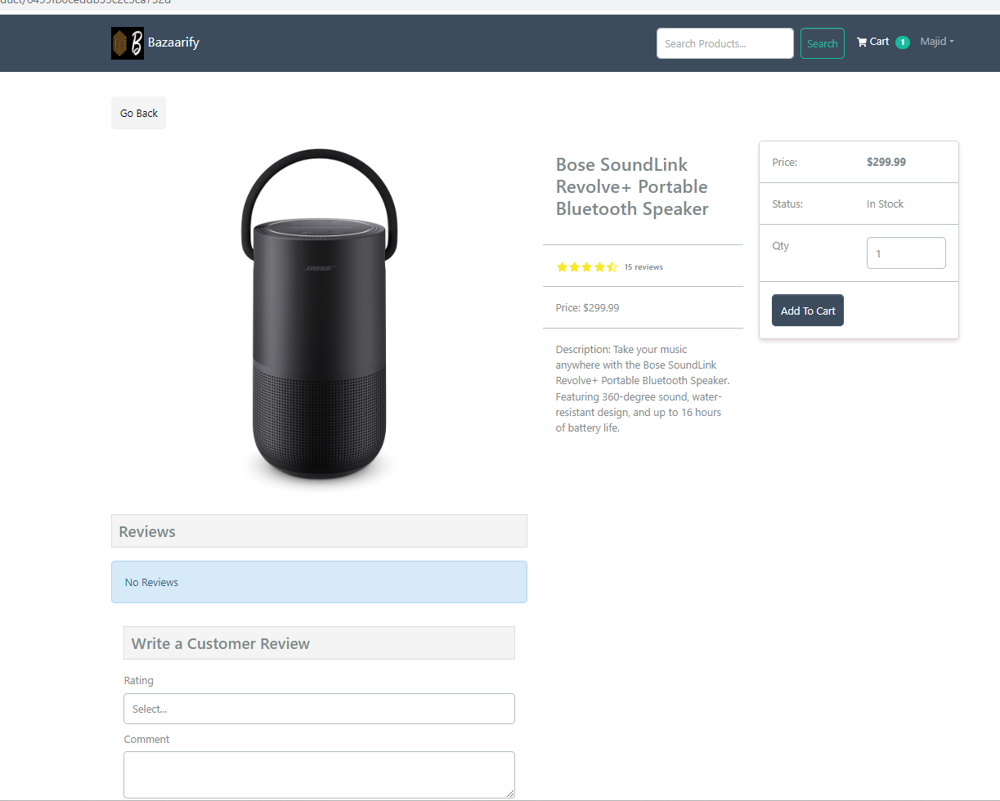
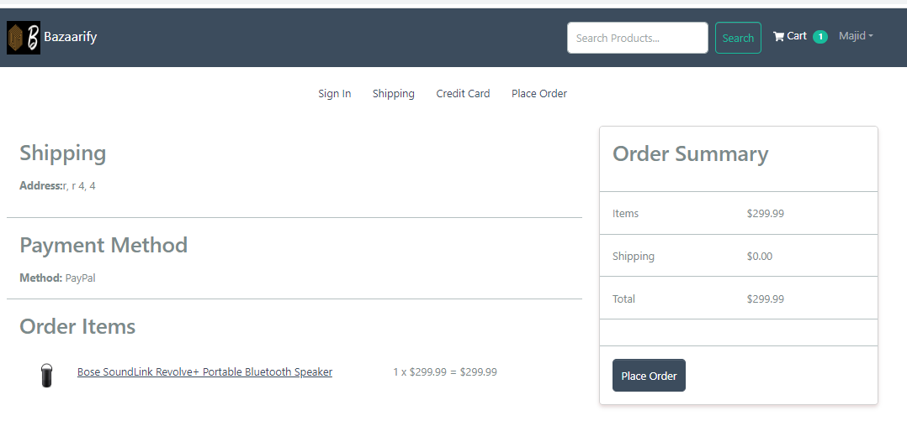
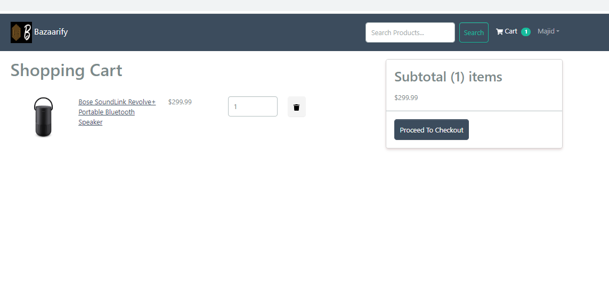

# Bazaarify

## Description
Bazaarify is a powerful and customizable multi-vendor ecommerce platform that allows businesses to create and manage their own online stores, and sell their products to customers all over the world. With Bazaarify, you can easily launch your own ecommerce marketplace.

## Table of Contents

* [Installation](#installation)
* [Technologies Used](#technologies-used)
* [Contributing](#contributing)
* [Screenshots](#Screenshots) 
* [Links](#links)
* [License](#license)

 ## Installation

- Clone the repository to your local machine.
- Install the required dependencies using npm install.
- Create a .env file with your environment variables.
- Start the development server using npm run dev.
 
## Technologies Used
- Mongodb/Atlas - to manage database
- Expressjs -  Is used as the back-end web application framework.
- Node.js - used for server-side run time environment.
- React- used for front-end.
- Redux- used for state management
- Vs Code- used to write code

## Contributing

## Screenshots

    

    

    

    

    

## links
### deployed link
https://bzfiyapp.herokuapp.com/
### Repositories
https://github.com/Sudarshans30/Bazarify

## License
 

MIT License

Copyright (c) 2023 Sudarshans30

Permission is hereby granted, free of charge, to any person obtaining a copy
of this software and associated documentation files (the "Software"), to deal
in the Software without restriction, including without limitation the rights
to use, copy, modify, merge, publish, distribute, sublicense, and/or sell
copies of the Software, and to permit persons to whom the Software is
furnished to do so, subject to the following conditions:

The above copyright notice and this permission notice shall be included in all
copies or substantial portions of the Software.

THE SOFTWARE IS PROVIDED "AS IS", WITHOUT WARRANTY OF ANY KIND, EXPRESS OR
IMPLIED, INCLUDING BUT NOT LIMITED TO THE WARRANTIES OF MERCHANTABILITY,
FITNESS FOR A PARTICULAR PURPOSE AND NONINFRINGEMENT. IN NO EVENT SHALL THE
AUTHORS OR COPYRIGHT HOLDERS BE LIABLE FOR ANY CLAIM, DAMAGES OR OTHER
LIABILITY, WHETHER IN AN ACTION OF CONTRACT, TORT OR OTHERWISE, ARISING FROM,
OUT OF OR IN CONNECTION WITH THE SOFTWARE OR THE USE OR OTHER DEALINGS IN THE
SOFTWARE.

